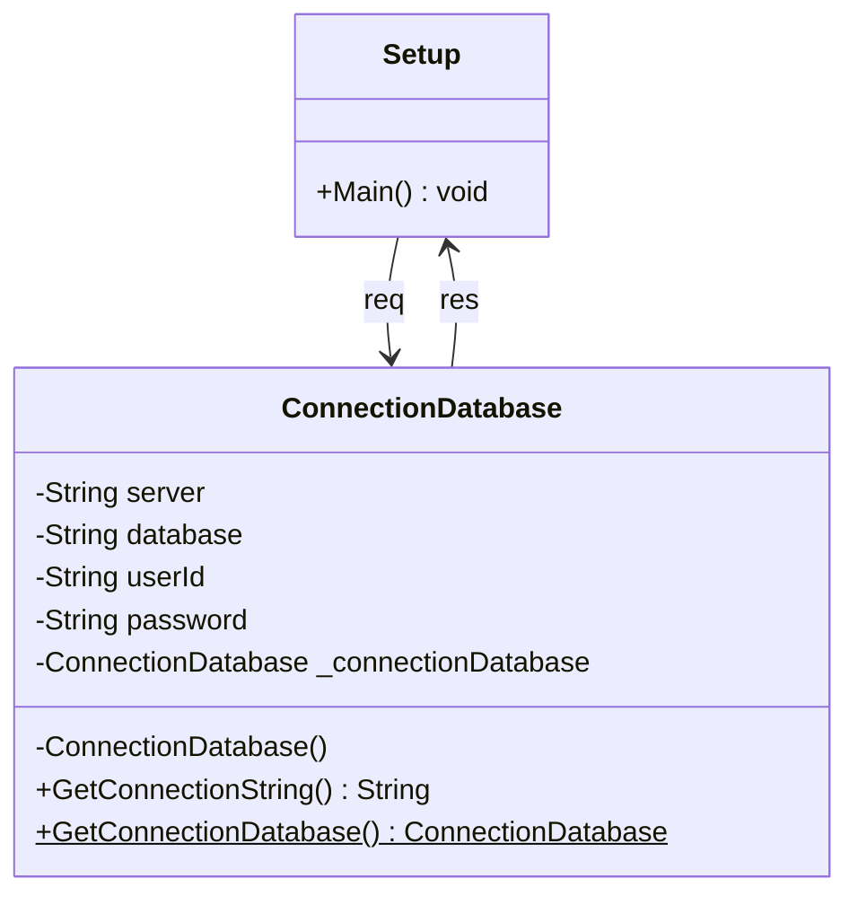

# Design Pattern - Singleton

Singleton pattern is one of the simplest design patterns in any language development. This type of design pattern comes under creational pattern as this pattern provides one of the best ways to create an object. This pattern involves a single class which is responsible to create an object while making sure that only single object gets created. This class provides a way to access its only object which can be accessed directly without need to instantiate the object of the class.

## Intent
Ensure a class only has one instance, and provide a global point of access to it.

## Motivation

It's important for some classes to have exactly one instance. Although there can be many printers in a system, there should be only one printer spooler. There should be only one file system and one window manager. A digital filter will have one A/D converter. An accounting system will be dedicated to serving one company. 
How do we ensure that a class has only one instance and that the instance is easily accessible? A global variable makes an object accessible, but it doesn't keep you from instantiating multiple objects.
A better solution is to make the class itself responsible for keeping track of its sole instance. The class can ensure that no other instance can be created (by intercepting requests to create new objects), and it can provide a way to access the instance. This is the Singleton pattern.

## Applicability

Use the Singleton pattern when:
- There must be exactly one instance of a class, and it must be accessible to clients from a well-known access point.
- The sole instance should be extensible by subclassing, and clients should be able to use an extended instance without modifying their code.

## Structure 
**UML**
![enter image description here](https://mermaid.ink/img/eyJjb2RlIjoiY2xhc3NEaWFncmFtXG5cbiAgICBTZXR1cCAtLT4gQ29ubmVjdGlvbkRhdGFiYXNlOiByZXFcbiAgICBDb25uZWN0aW9uRGF0YWJhc2UgLS0-IFNldHVwIDogcmVzXG5cbiAgICBjbGFzcyBTZXR1cFxuICAgIFNldHVwOiArTWFpbigpIHZvaWRcblxuICAgIGNsYXNzIENvbm5lY3Rpb25EYXRhYmFzZVxuICAgIENvbm5lY3Rpb25EYXRhYmFzZSA6IC1TdHJpbmcgc2VydmVyXG4gICAgQ29ubmVjdGlvbkRhdGFiYXNlIDogLVN0cmluZyBkYXRhYmFzZVxuICAgIENvbm5lY3Rpb25EYXRhYmFzZSA6IC1TdHJpbmcgdXNlcklkXG4gICAgQ29ubmVjdGlvbkRhdGFiYXNlIDogLVN0cmluZyBwYXNzd29yZFxuICAgIENvbm5lY3Rpb25EYXRhYmFzZTogLUNvbm5lY3Rpb25EYXRhYmFzZSBfY29ubmVjdGlvbkRhdGFiYXNlXG4gICAgQ29ubmVjdGlvbkRhdGFiYXNlIDogLUNvbm5lY3Rpb25EYXRhYmFzZSgpXG4gICAgQ29ubmVjdGlvbkRhdGFiYXNlIDogK0dldENvbm5lY3Rpb25TdHJpbmcoKSBTdHJpbmdcbiAgICBDb25uZWN0aW9uRGF0YWJhc2UgOiArR2V0Q29ubmVjdGlvbkRhdGFiYXNlKCkkIENvbm5lY3Rpb25EYXRhYmFzZVxuXG4gICAgIiwibWVybWFpZCI6eyJ0aGVtZSI6ImRlZmF1bHQiLCJ0aGVtZVZhcmlhYmxlcyI6eyJiYWNrZ3JvdW5kIjoid2hpdGUiLCJwcmltYXJ5Q29sb3IiOiIjRUNFQ0ZGIiwic2Vjb25kYXJ5Q29sb3IiOiIjZmZmZmRlIiwidGVydGlhcnlDb2xvciI6ImhzbCg4MCwgMTAwJSwgOTYuMjc0NTA5ODAzOSUpIiwicHJpbWFyeUJvcmRlckNvbG9yIjoiaHNsKDI0MCwgNjAlLCA4Ni4yNzQ1MDk4MDM5JSkiLCJzZWNvbmRhcnlCb3JkZXJDb2xvciI6ImhzbCg2MCwgNjAlLCA4My41Mjk0MTE3NjQ3JSkiLCJ0ZXJ0aWFyeUJvcmRlckNvbG9yIjoiaHNsKDgwLCA2MCUsIDg2LjI3NDUwOTgwMzklKSIsInByaW1hcnlUZXh0Q29sb3IiOiIjMTMxMzAwIiwic2Vjb25kYXJ5VGV4dENvbG9yIjoiIzAwMDAyMSIsInRlcnRpYXJ5VGV4dENvbG9yIjoicmdiKDkuNTAwMDAwMDAwMSwgOS41MDAwMDAwMDAxLCA5LjUwMDAwMDAwMDEpIiwibGluZUNvbG9yIjoiIzMzMzMzMyIsInRleHRDb2xvciI6IiMzMzMiLCJtYWluQmtnIjoiI0VDRUNGRiIsInNlY29uZEJrZyI6IiNmZmZmZGUiLCJib3JkZXIxIjoiIzkzNzBEQiIsImJvcmRlcjIiOiIjYWFhYTMzIiwiYXJyb3doZWFkQ29sb3IiOiIjMzMzMzMzIiwiZm9udEZhbWlseSI6IlwidHJlYnVjaGV0IG1zXCIsIHZlcmRhbmEsIGFyaWFsIiwiZm9udFNpemUiOiIxNnB4IiwibGFiZWxCYWNrZ3JvdW5kIjoiI2U4ZThlOCIsIm5vZGVCa2ciOiIjRUNFQ0ZGIiwibm9kZUJvcmRlciI6IiM5MzcwREIiLCJjbHVzdGVyQmtnIjoiI2ZmZmZkZSIsImNsdXN0ZXJCb3JkZXIiOiIjYWFhYTMzIiwiZGVmYXVsdExpbmtDb2xvciI6IiMzMzMzMzMiLCJ0aXRsZUNvbG9yIjoiIzMzMyIsImVkZ2VMYWJlbEJhY2tncm91bmQiOiIjZThlOGU4IiwiYWN0b3JCb3JkZXIiOiJoc2woMjU5LjYyNjE2ODIyNDMsIDU5Ljc3NjUzNjMxMjglLCA4Ny45MDE5NjA3ODQzJSkiLCJhY3RvckJrZyI6IiNFQ0VDRkYiLCJhY3RvclRleHRDb2xvciI6ImJsYWNrIiwiYWN0b3JMaW5lQ29sb3IiOiJncmV5Iiwic2lnbmFsQ29sb3IiOiIjMzMzIiwic2lnbmFsVGV4dENvbG9yIjoiIzMzMyIsImxhYmVsQm94QmtnQ29sb3IiOiIjRUNFQ0ZGIiwibGFiZWxCb3hCb3JkZXJDb2xvciI6ImhzbCgyNTkuNjI2MTY4MjI0MywgNTkuNzc2NTM2MzEyOCUsIDg3LjkwMTk2MDc4NDMlKSIsImxhYmVsVGV4dENvbG9yIjoiYmxhY2siLCJsb29wVGV4dENvbG9yIjoiYmxhY2siLCJub3RlQm9yZGVyQ29sb3IiOiIjYWFhYTMzIiwibm90ZUJrZ0NvbG9yIjoiI2ZmZjVhZCIsIm5vdGVUZXh0Q29sb3IiOiJibGFjayIsImFjdGl2YXRpb25Cb3JkZXJDb2xvciI6IiM2NjYiLCJhY3RpdmF0aW9uQmtnQ29sb3IiOiIjZjRmNGY0Iiwic2VxdWVuY2VOdW1iZXJDb2xvciI6IndoaXRlIiwic2VjdGlvbkJrZ0NvbG9yIjoicmdiYSgxMDIsIDEwMiwgMjU1LCAwLjQ5KSIsImFsdFNlY3Rpb25Ca2dDb2xvciI6IndoaXRlIiwic2VjdGlvbkJrZ0NvbG9yMiI6IiNmZmY0MDAiLCJ0YXNrQm9yZGVyQ29sb3IiOiIjNTM0ZmJjIiwidGFza0JrZ0NvbG9yIjoiIzhhOTBkZCIsInRhc2tUZXh0TGlnaHRDb2xvciI6IndoaXRlIiwidGFza1RleHRDb2xvciI6IndoaXRlIiwidGFza1RleHREYXJrQ29sb3IiOiJibGFjayIsInRhc2tUZXh0T3V0c2lkZUNvbG9yIjoiYmxhY2siLCJ0YXNrVGV4dENsaWNrYWJsZUNvbG9yIjoiIzAwMzE2MyIsImFjdGl2ZVRhc2tCb3JkZXJDb2xvciI6IiM1MzRmYmMiLCJhY3RpdmVUYXNrQmtnQ29sb3IiOiIjYmZjN2ZmIiwiZ3JpZENvbG9yIjoibGlnaHRncmV5IiwiZG9uZVRhc2tCa2dDb2xvciI6ImxpZ2h0Z3JleSIsImRvbmVUYXNrQm9yZGVyQ29sb3IiOiJncmV5IiwiY3JpdEJvcmRlckNvbG9yIjoiI2ZmODg4OCIsImNyaXRCa2dDb2xvciI6InJlZCIsInRvZGF5TGluZUNvbG9yIjoicmVkIiwibGFiZWxDb2xvciI6ImJsYWNrIiwiZXJyb3JCa2dDb2xvciI6IiM1NTIyMjIiLCJlcnJvclRleHRDb2xvciI6IiM1NTIyMjIiLCJjbGFzc1RleHQiOiIjMTMxMzAwIiwiZmlsbFR5cGUwIjoiI0VDRUNGRiIsImZpbGxUeXBlMSI6IiNmZmZmZGUiLCJmaWxsVHlwZTIiOiJoc2woMzA0LCAxMDAlLCA5Ni4yNzQ1MDk4MDM5JSkiLCJmaWxsVHlwZTMiOiJoc2woMTI0LCAxMDAlLCA5My41Mjk0MTE3NjQ3JSkiLCJmaWxsVHlwZTQiOiJoc2woMTc2LCAxMDAlLCA5Ni4yNzQ1MDk4MDM5JSkiLCJmaWxsVHlwZTUiOiJoc2woLTQsIDEwMCUsIDkzLjUyOTQxMTc2NDclKSIsImZpbGxUeXBlNiI6ImhzbCg4LCAxMDAlLCA5Ni4yNzQ1MDk4MDM5JSkiLCJmaWxsVHlwZTciOiJoc2woMTg4LCAxMDAlLCA5My41Mjk0MTE3NjQ3JSkifX19)

**Code Mermaid**

## Participants
- Singleton
	- defines an Instance operation that lets clients access its unique instance. Instance is a class operation (that is, a class method in Smalltalk and a static member function in C#).
	-	may be responsible for creating its own unique instance.

## Collaborations
- Clients access a Singleton instance solely through Singleton's Instance operation.
## Consequences
The Singleton pattern has several benefits:
 1. **Controlled access to sole instance.** Because the Singleton class encapsulates its sole instance, it can have strict control over how and when clients access it.
 2. **Reduced name space.** The Singleton pattern is an improvement over global variables. It avoids polluting the name space with global variables that store sole instances.
 3. **Permits refinement of operations and representation.** The Singleton class may be subclassed, and it's easy to configure an application with an instance of this extended class. You can configure the application with an instance
of the class you need at run-time.
  4. **Permits a variable number of instances.** The pattern makes it easy to change your mind and allow more than one instance of the Singleton class. Moreover, you can use the same approach to control the number of instances that the application uses. Only the operation that grants access to the Singleton instance needs to change.
5. **More flexible than class operations.** Another way to package a singleton's functionality is to use class operations (that  is, static member functions in C# or class methods in Smalltalk). But both of these language techniques make it hard to change a design to allow more than one instance of a class. Moreover, static member functions in C# are never virtual, so subclasses can't override them polymorphically.

## Bibliography
**[Book]** 
Gang of Four Desig Patterns - Elements of Reusable Object-Oriented Software by Erich Gamma, Richard Helm, Ralph Johnson and John Vlissides.

**[Web]** 
https://sourcemaking.com/design_patterns/singleton

**[Web]** 
https://www.tutorialspoint.com/design_pattern/singleton_pattern.htm

**[Tutorial]** 
https://www.youtube.com/watch?v=gocJeOHtj9w

**[Mermaid]**
https://mermaid-js.github.io/mermaid-live-editor/#/edit/eyJjb2RlIjoiY2xhc3NEaWFncmFtXG5cbiAgICBTZXR1cCAtLT4gQ29ubmVjdGlvbkRhdGFiYXNlOiByZXFcbiAgICBDb25uZWN0aW9uRGF0YWJhc2UgLS0-IFNldHVwIDogcmVzXG5cbiAgICBjbGFzcyBTZXR1cFxuICAgIFNldHVwOiArTWFpbigpIHZvaWRcblxuICAgIGNsYXNzIENvbm5lY3Rpb25EYXRhYmFzZVxuICAgIENvbm5lY3Rpb25EYXRhYmFzZSA6IC1TdHJpbmcgc2VydmVyXG4gICAgQ29ubmVjdGlvbkRhdGFiYXNlIDogLVN0cmluZyBkYXRhYmFzZVxuICAgIENvbm5lY3Rpb25EYXRhYmFzZSA6IC1TdHJpbmcgdXNlcklkXG4gICAgQ29ubmVjdGlvbkRhdGFiYXNlIDogLVN0cmluZyBwYXNzd29yZFxuICAgIENvbm5lY3Rpb25EYXRhYmFzZTogLUNvbm5lY3Rpb25EYXRhYmFzZSBfY29ubmVjdGlvbkRhdGFiYXNlXG4gICAgQ29ubmVjdGlvbkRhdGFiYXNlIDogLUNvbm5lY3Rpb25EYXRhYmFzZSgpXG4gICAgQ29ubmVjdGlvbkRhdGFiYXNlIDogK0dldENvbm5lY3Rpb25TdHJpbmcoKSBTdHJpbmdcbiAgICBDb25uZWN0aW9uRGF0YWJhc2UgOiArR2V0Q29ubmVjdGlvbkRhdGFiYXNlKCkkIENvbm5lY3Rpb25EYXRhYmFzZVxuXG4gICAgIiwibWVybWFpZCI6eyJ0aGVtZSI6ImRlZmF1bHQiLCJ0aGVtZVZhcmlhYmxlcyI6eyJiYWNrZ3JvdW5kIjoid2hpdGUiLCJwcmltYXJ5Q29sb3IiOiIjRUNFQ0ZGIiwic2Vjb25kYXJ5Q29sb3IiOiIjZmZmZmRlIiwidGVydGlhcnlDb2xvciI6ImhzbCg4MCwgMTAwJSwgOTYuMjc0NTA5ODAzOSUpIiwicHJpbWFyeUJvcmRlckNvbG9yIjoiaHNsKDI0MCwgNjAlLCA4Ni4yNzQ1MDk4MDM5JSkiLCJzZWNvbmRhcnlCb3JkZXJDb2xvciI6ImhzbCg2MCwgNjAlLCA4My41Mjk0MTE3NjQ3JSkiLCJ0ZXJ0aWFyeUJvcmRlckNvbG9yIjoiaHNsKDgwLCA2MCUsIDg2LjI3NDUwOTgwMzklKSIsInByaW1hcnlUZXh0Q29sb3IiOiIjMTMxMzAwIiwic2Vjb25kYXJ5VGV4dENvbG9yIjoiIzAwMDAyMSIsInRlcnRpYXJ5VGV4dENvbG9yIjoicmdiKDkuNTAwMDAwMDAwMSwgOS41MDAwMDAwMDAxLCA5LjUwMDAwMDAwMDEpIiwibGluZUNvbG9yIjoiIzMzMzMzMyIsInRleHRDb2xvciI6IiMzMzMiLCJtYWluQmtnIjoiI0VDRUNGRiIsInNlY29uZEJrZyI6IiNmZmZmZGUiLCJib3JkZXIxIjoiIzkzNzBEQiIsImJvcmRlcjIiOiIjYWFhYTMzIiwiYXJyb3doZWFkQ29sb3IiOiIjMzMzMzMzIiwiZm9udEZhbWlseSI6IlwidHJlYnVjaGV0IG1zXCIsIHZlcmRhbmEsIGFyaWFsIiwiZm9udFNpemUiOiIxNnB4IiwibGFiZWxCYWNrZ3JvdW5kIjoiI2U4ZThlOCIsIm5vZGVCa2ciOiIjRUNFQ0ZGIiwibm9kZUJvcmRlciI6IiM5MzcwREIiLCJjbHVzdGVyQmtnIjoiI2ZmZmZkZSIsImNsdXN0ZXJCb3JkZXIiOiIjYWFhYTMzIiwiZGVmYXVsdExpbmtDb2xvciI6IiMzMzMzMzMiLCJ0aXRsZUNvbG9yIjoiIzMzMyIsImVkZ2VMYWJlbEJhY2tncm91bmQiOiIjZThlOGU4IiwiYWN0b3JCb3JkZXIiOiJoc2woMjU5LjYyNjE2ODIyNDMsIDU5Ljc3NjUzNjMxMjglLCA4Ny45MDE5NjA3ODQzJSkiLCJhY3RvckJrZyI6IiNFQ0VDRkYiLCJhY3RvclRleHRDb2xvciI6ImJsYWNrIiwiYWN0b3JMaW5lQ29sb3IiOiJncmV5Iiwic2lnbmFsQ29sb3IiOiIjMzMzIiwic2lnbmFsVGV4dENvbG9yIjoiIzMzMyIsImxhYmVsQm94QmtnQ29sb3IiOiIjRUNFQ0ZGIiwibGFiZWxCb3hCb3JkZXJDb2xvciI6ImhzbCgyNTkuNjI2MTY4MjI0MywgNTkuNzc2NTM2MzEyOCUsIDg3LjkwMTk2MDc4NDMlKSIsImxhYmVsVGV4dENvbG9yIjoiYmxhY2siLCJsb29wVGV4dENvbG9yIjoiYmxhY2siLCJub3RlQm9yZGVyQ29sb3IiOiIjYWFhYTMzIiwibm90ZUJrZ0NvbG9yIjoiI2ZmZjVhZCIsIm5vdGVUZXh0Q29sb3IiOiJibGFjayIsImFjdGl2YXRpb25Cb3JkZXJDb2xvciI6IiM2NjYiLCJhY3RpdmF0aW9uQmtnQ29sb3IiOiIjZjRmNGY0Iiwic2VxdWVuY2VOdW1iZXJDb2xvciI6IndoaXRlIiwic2VjdGlvbkJrZ0NvbG9yIjoicmdiYSgxMDIsIDEwMiwgMjU1LCAwLjQ5KSIsImFsdFNlY3Rpb25Ca2dDb2xvciI6IndoaXRlIiwic2VjdGlvbkJrZ0NvbG9yMiI6IiNmZmY0MDAiLCJ0YXNrQm9yZGVyQ29sb3IiOiIjNTM0ZmJjIiwidGFza0JrZ0NvbG9yIjoiIzhhOTBkZCIsInRhc2tUZXh0TGlnaHRDb2xvciI6IndoaXRlIiwidGFza1RleHRDb2xvciI6IndoaXRlIiwidGFza1RleHREYXJrQ29sb3IiOiJibGFjayIsInRhc2tUZXh0T3V0c2lkZUNvbG9yIjoiYmxhY2siLCJ0YXNrVGV4dENsaWNrYWJsZUNvbG9yIjoiIzAwMzE2MyIsImFjdGl2ZVRhc2tCb3JkZXJDb2xvciI6IiM1MzRmYmMiLCJhY3RpdmVUYXNrQmtnQ29sb3IiOiIjYmZjN2ZmIiwiZ3JpZENvbG9yIjoibGlnaHRncmV5IiwiZG9uZVRhc2tCa2dDb2xvciI6ImxpZ2h0Z3JleSIsImRvbmVUYXNrQm9yZGVyQ29sb3IiOiJncmV5IiwiY3JpdEJvcmRlckNvbG9yIjoiI2ZmODg4OCIsImNyaXRCa2dDb2xvciI6InJlZCIsInRvZGF5TGluZUNvbG9yIjoicmVkIiwibGFiZWxDb2xvciI6ImJsYWNrIiwiZXJyb3JCa2dDb2xvciI6IiM1NTIyMjIiLCJlcnJvclRleHRDb2xvciI6IiM1NTIyMjIiLCJjbGFzc1RleHQiOiIjMTMxMzAwIiwiZmlsbFR5cGUwIjoiI0VDRUNGRiIsImZpbGxUeXBlMSI6IiNmZmZmZGUiLCJmaWxsVHlwZTIiOiJoc2woMzA0LCAxMDAlLCA5Ni4yNzQ1MDk4MDM5JSkiLCJmaWxsVHlwZTMiOiJoc2woMTI0LCAxMDAlLCA5My41Mjk0MTE3NjQ3JSkiLCJmaWxsVHlwZTQiOiJoc2woMTc2LCAxMDAlLCA5Ni4yNzQ1MDk4MDM5JSkiLCJmaWxsVHlwZTUiOiJoc2woLTQsIDEwMCUsIDkzLjUyOTQxMTc2NDclKSIsImZpbGxUeXBlNiI6ImhzbCg4LCAxMDAlLCA5Ni4yNzQ1MDk4MDM5JSkiLCJmaWxsVHlwZTciOiJoc2woMTg4LCAxMDAlLCA5My41Mjk0MTE3NjQ3JSkifX19

# Support
Support This Project to keep it active.

	

# About me

I'm software developer from Ecuador
> Name: Alejandro Junqui (@ajunquit)
> Web Site: ajunquit.com/website
> Email: ajunquit@gmail.com
